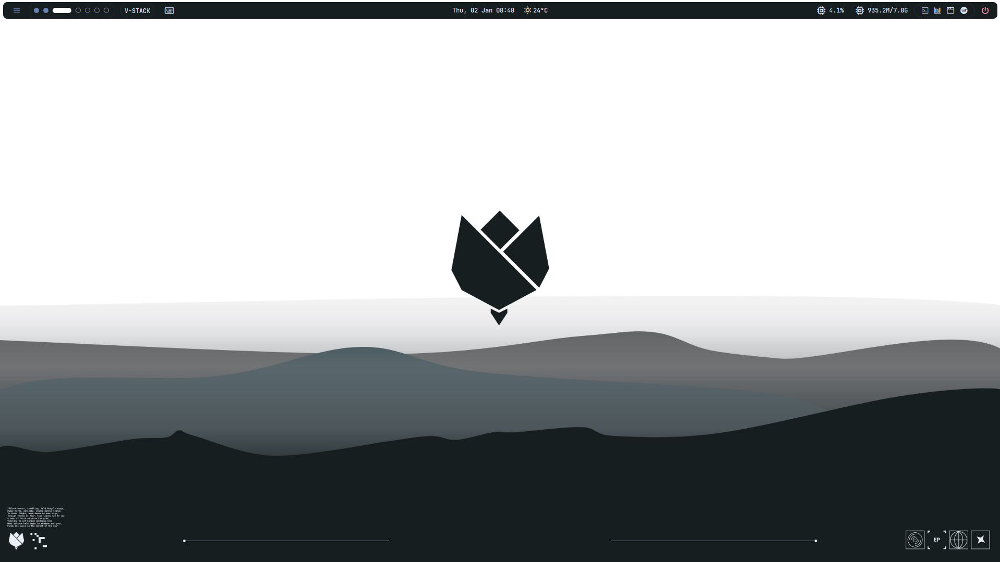
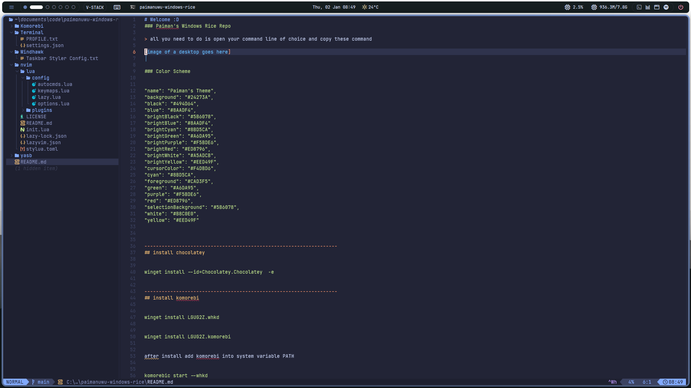

# Welcome :D
### Paiman's Windows Rice Repo

> these are my go to theme for the year 2025, Feel free to use the Rice also. And sorry if the configuration looks bad (I tried)




### Color Scheme

```
"name": "Paiman's Theme",
"background": "#24273A",
"black": "#494D64",
"blue": "#8AADF4",
"brightBlack": "#5B6078",
"brightBlue": "#8AADF4",
"brightCyan": "#8BD5CA",
"brightGreen": "#A6DA95",
"brightPurple": "#F5BDE6",
"brightRed": "#ED8796",
"brightWhite": "#A5ADCB",
"brightYellow": "#EED49F",
"cursorColor": "#F4DBD6",
"cyan": "#8BD5CA",
"foreground": "#CAD3F5",
"green": "#A6DA95",
"purple": "#F5BDE6",
"red": "#ED8796",
"selectionBackground": "#5B6078",
"white": "#B8C0E0",
"yellow": "#EED49F"
```

### Installation

[Installation Guide](https://github.com/PaimanUwU/PaimanUwU-Windows-Rice/blob/main/INSTALLATION.md)

